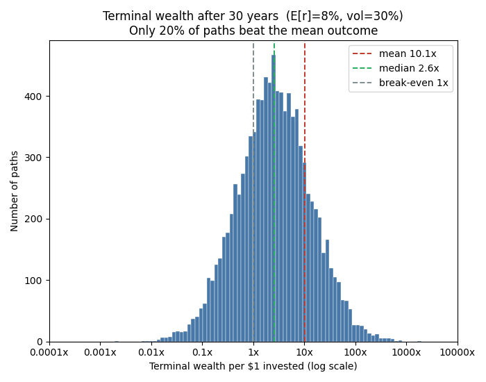
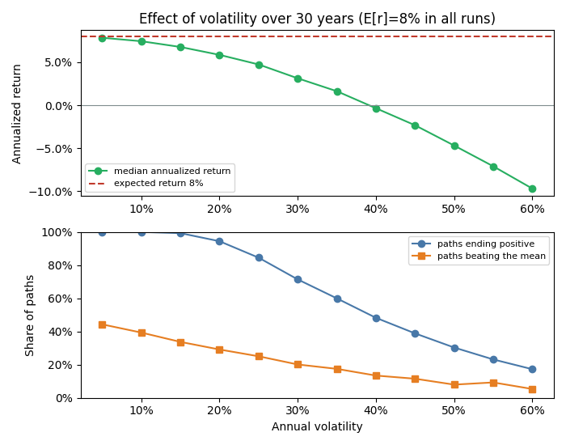

# skewness_stocks

GUI tool that simulates buy-and-hold stock returns via Monte Carlo and
shows how the compounding of random returns induces strong positive
skewness into long-horizon outcomes — the effect described in
Bessembinder, *"One Hundred Years in the U.S. Stock Markets"* (2026):
across 29,754 U.S. stocks over 100 years the **mean** buy-and-hold return
was over 30,000% while the **median** was −6.9%. The main driver of this
skewness is the volatility of short-horizon returns
(Farago & Hjalmarsson, 2023).

## What it does

Returns are modeled as i.i.d. normal log-returns per step (geometric
Brownian motion). The drift is calibrated so that the *expected
arithmetic* annual return exactly matches the input, so the gap between
mean and median ("volatility drag") emerges naturally:

```
E[terminal wealth]      = (1 + R)^T
median[terminal wealth] = (1 + R)^T · exp(−σ²·T/2)
```

The GUI shows three views:

- **Distribution** — histogram of terminal wealth with mean, median and
  break-even marked; switchable between log scale (distribution looks
  symmetric) and linear scale (the raw skew is visible, clipped at the
  99th percentile)
- **Sample paths** — 100 simulated wealth paths vs. the expected-value
  path
- **Volatility sweep** — median annualized return, share of paths ending
  positive and share beating the mean, as a function of volatility
  (all at the same expected return)

plus a stats panel with mean/median terminal wealth, lifetime
(buy-and-hold) percentage returns as reported in the paper, quantiles,
skewness and the share of paths that end positive, beat the risk-free
asset, or beat the mean outcome.




## Inputs and defaults

| Input | Default | Rationale |
|---|---|---|
| Expected return (% p.a.) | 8 | Arithmetic expectation; long-run U.S. equity ballpark |
| Volatility (% p.a.) | 30 | Typical single stock (use ~16 for a broad index) |
| Horizon (years) | 30 | Long-term investor / retirement horizon |
| Number of paths | 10,000 | Smooth distribution, still fast |
| Steps per year | 12 | Monthly, like the CRSP data in the paper |
| Risk-free rate (% p.a.) | 3 | T-bills returned 3.3% p.a. over 1926–2025 |
| Random seed | 42 | Reproducible; leave blank for a random seed |

With the defaults, the mean outcome after 30 years is ~10x the initial
investment, but the median is only ~2.6x, only ~20% of paths beat the
mean, and ~28% lose money — the Bessembinder effect in miniature.

## Installation

```
pip install -r requirements.txt
```

## Usage

```
python skewness_simulator.py
```

## Caveats

This is a stylized model: real stock returns have fat tails, stochastic
volatility and firm death (delisting), all of which make the skewness
even more extreme than the lognormal case shown here.
